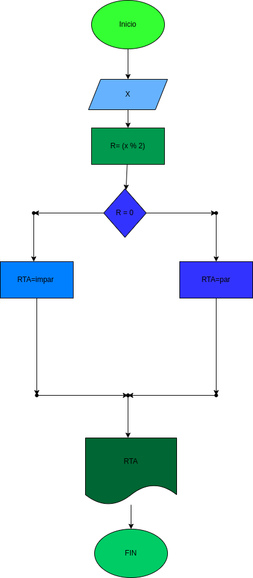

# Ejercicio N°4

## poder diferenciar si un numero es par o impar

# ANALISIS

Variables de entrada(input)

X: Un numero que puede ser par o puede ser impar

Variables de proceso y salida (processing,storage, output)

r = x % 2: sera lo que sacara el modulo del numero entre 2

r == 0: sera lo que utilizara para calcular si el numero es par o impar

# DISEÑO

# CONTRUCCION

